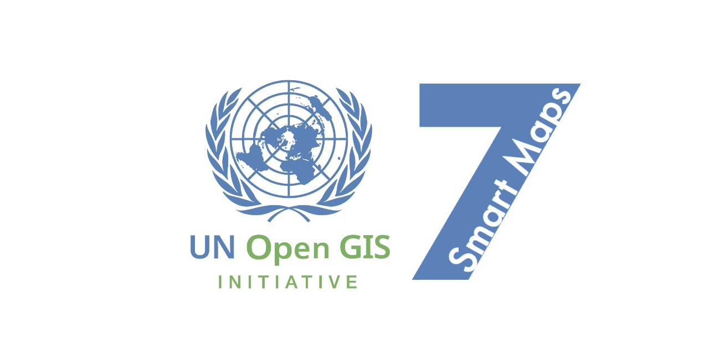

# ブランドガイドライン

## 名前の原則とガイドライン

### 名前のポリシー
1. 名前は単純で、覚えやすく、理解できるものにしたいと私たちは考えます。
2. テキストはできるだけ短く。なので、私たちは短い名前を好みます。
3. 国連ブランドを適切な時に利用する特権は活用したいと私たちは思います。他方で、国連の名を騙ることにならないよう思慮深くありたいと私たちは思います。私たちは、だまされたと思う人がいて欲しくありません。

### 名前のガイドライン
1. 私たちはそれが適切なとき、普通は **UN Smart Maps** を使います。私たちはこれを*私たちの標準ブランド*と考えます。 
2. 打ち解けた友好的文脈では、私たちは*ニックネームとして*単純に **Smart Maps** を使います。 
3. 私たちの活動のうちの何かを特定するとき、**Smart Maps**の後ろに語を加えます。例： **Smart Maps Meetup**, **Smart Maps Bazaar**, **Smart Maps Group**, それからたぶん将来的には **Smart Maps Portable**。UNを接頭させてもOKです。でも、名前は短く、できれば4語よりも少なくしたいと私たちは思います。
4. 私たちは常に**Maps**を複数形で使います。私たちは単数形の**Smart Map**を使いません。 
5. それが必要か適切なときには、私たちは **DWG** や **7** も加えます。しかし、私たちのブランドは単純で覚えやすいものでありたいとも思います。私たちが普通**UN Smart Maps**を使うのはそのためです。 
6. 日本語では、**国連スマート地図**が*私たちの標準ブランド*です。

## 色のスキーム
| 色名 | RGB | Hex | 説明 |
|------------|-----|-----|-------------|
| スマートブルー | rgb(92, 129, 184) | #5c81b8 | イノベーション、明快さ、コミュニティ内での知識とリソースのオープンな交換を表します。 |
| コラボレーショングリーン | rgb(151, 190, 132) | #97be84 | コミュニティ内の協力と統一の精神を示します。 |
| イノベーションレッド | rgb(222, 129, 129) | #de8181 | 地理空間技術における革新と先進的な実践へのコミットメントを体現します。 |

UNスマート地図のカラースキームは、スマートブルー、コラボレーショングリーン、イノベーションレッドの3つのキーカラーで構成されています。各色は、UNスマート地図グループとそのイニシアチブの価値観と原則を視覚的に表現し、コミュニティ内でのアイデンティティと統一感を育みながら、私たちの活動と目標を効果的に認識させるために慎重に選ばれています。

- スマートブルー: スマートブルー（RGB: rgb(92, 129, 184), #5c81b8）は、UNスマート地図グループの知的で洗練されたアプローチを表します。イノベーション、明快さ、コミュニティ内での知識とリソースのオープンな交換を象徴しています。
- コラボレーショングリーン: コラボレーショングリーン（RGB: rgb(151, 190, 132), #97be84）は、コミュニティ内の協力と統一の精神を示します。異なるバックグラウンドや分野を横断して共通の目標を達成し、グローバルな課題に取り組むために協力することへのコミットメントを反映しています。
- イノベーションレッド: イノベーションレッド（RGB: rgb(222, 129, 129), #de8181）は、地理空間技術における革新と先進的な実践へのコミットメントを体現しています。新しいアイデア、方法論、技術を受け入れ、意思決定の改善と世界的なポジティブな変化を促進するために新しいアイデア、方法論、技術を受け入れる意思を表しています。

これらの色、スマートブルー、コラボレーショングリーン、イノベーションレッドは、UNスマート地図カラースキームを構成しています。これらは、私たちのビジュアルアイデンティティに不可欠であり、私たちの組織とそのミッションを効果的に表現するために様々なプラットフォームで利用されています。

## フォント
国連スマート地図では次のフォントを使います:
- 見出しには[Futura](https://fonts.adobe.com/fonts/futura-pt)

## ロゴ

## ソーシャルプレビューイメージ

